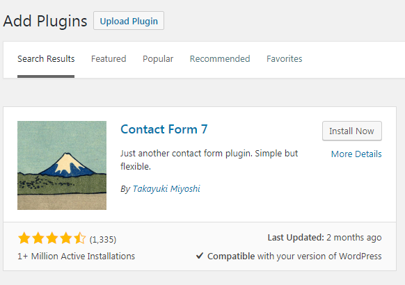
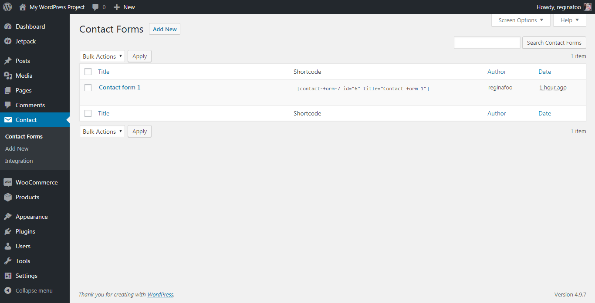
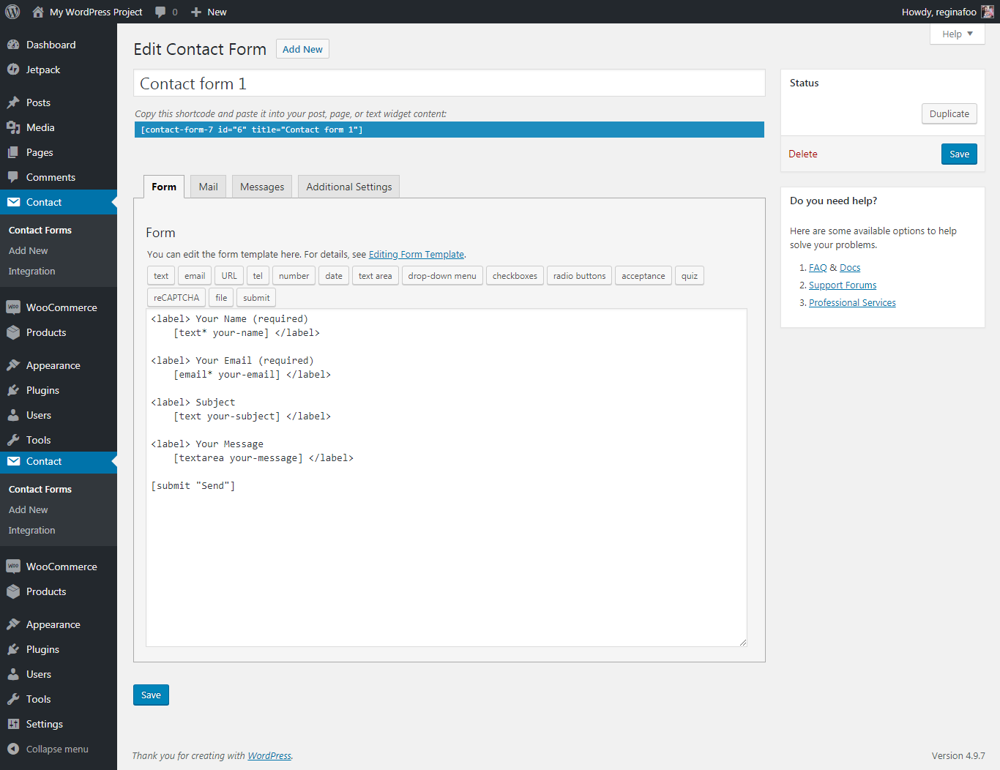
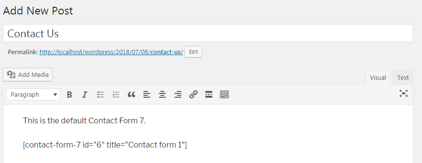
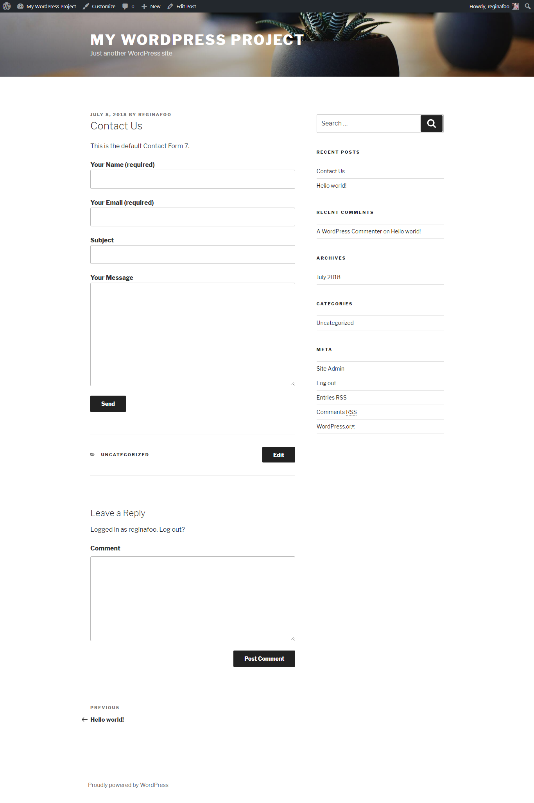

# What Is Contact Form 7
> To Do
> * "Have you thought about" section. Need input what to write.
## Description

Contact Form 7 is an easy-to-use plugin to create and add a contact form to your WordPress website. In this lesson, you will learn how to prepare and install the plugin and create and customize your first form, as well as setting up notifications to yourself and the form submitter.

## Objectives

After completing this lesson, participants will be able to:

*   Explain the purpose of using Contact Form 7 plugin
*   Add contact form into pages
*   Customize contact forms according to requirements

## Target Audience

Who is this lesson intended for? What interests/skills would they bring? Choose all that apply.

* [X] Users
* [X] Designers
* [ ] Developers
* [ ] Speakers
* [ ] All

## Experience Level

How much experience would a participant need to get the most from this lesson?

* [x] Beginner
* [x] Intermediate
* [ ] Advanced
* [ ] Any

## Type of Instruction

Which strategies will be used for this lesson plan? Choose all that apply.

* [X] Demonstration
* [ ] Discussion
* [X] Exercises
* [ ] Feedback
* [x] Lecture (Presentation)
* [x] Show & Tell
* [ ] Tutorial

## Time Estimate (Duration)

How long will it take to teach this lesson (in minutes)?

45 minutes

## Prerequisite Skills

Participants will get the most from this lesson if they have familiarity with:

*   Ability to [install a plugin](https://make.wordpress.org/training/handbook/user-lessons/choosing-and-installing-plugins/) from the WordPress.org repository
*   Ability to [create and edit pages](https://make.wordpress.org/training/handbook/user-lessons/pages-vs-posts/) on your WordPress website

## Readiness Questions

*   Do you have a self-hosted WordPress.org website (vs. WordPress.com website)?
*   Do you have a user role that allows you to install plugins?
*   Have you made a backup of your site before installing any plugins?
*   Have you installed the Contact Form 7 plugin from the WordPress.org plugin respository?

## Materials Needed

*   [Contact Form 7](https://wordpress.org/plugins/contact-form-7/) plugin

## Notes for the Instructor

*   It is recommended that all students have made a backup of their site and have installed the Contact Form 7 plugin before working through this lesson. If they have not, ask them to do so before they get started, but the specifics of how to do so will not be covered in this lesson.
*   The recommended way to approach the scenarios would be to demonstrate and explain the process first and then ask students to repeat the actions using their own devices, while you’re available for questions and troubleshooting if something doesn’t work out.

## Have You Thought About...?

* Challenge 1
* Challenge 2

> What could present challenges to delivering this lesson? Is there anything that can be done in advance to prepare for those challenges?
>
> _For example:_
>
> *  What if there’s no internet available?
> *  What if there’s no projector available?
> *  What if a participant doesn’t has a WordPress site to work with?
> *  What if there aren’t enough computers for everyone?
> *  What if no one has the prerequisite skills? What if there are different opinions about the topic?

## Lesson Overview

* A brief introduction on Contact Form 7
* Demonstrate how to add a contact form to a page
* Demonstrate how to customize a contact form
* Practice exercises to have participants add a customized contact form to a post


## Exercises

**Adding new contact form with mandatory fields**

Practice creating a form with the Contact Form 7 plugin.

*   Add a new contact form to Contact Page of your site or any other location of your choice.
* Customize the form to make below fields as mandatory inputs
	* Name
	* Email address

**Create a questionnaire**

Practice creating a questionnaire containing five questions with the Contact Form 7 plugin.

*   Add new Contact Forms on Contact Form 7 plugin screen
* Design a form with five questions that contains below input types
	* Radio buttons
	* Checkboxes


## Assessment

**Which of the following is a Contact Form 7 tag?**

1.  Your Message  

2.  [textarea your-message 40x2]
3.  ["Enter your message" textarea your-message]
4.  form.wpcf7-form {text-align: center;}

Correct answer: 2. [textarea your-message 40x2]

**What symbol is used to mark a field is required to answer?**

1.  !
2.  /
3.  &
4.  *

Correct answer: 4.*

## Additional Resources

*  [Getting Started with Contact Form 7](http://contactform7.com/getting-started-with-contact-form-7/)
*  [Contact Form 7: Documentation](http://contactform7.com/docs/)

## Example Lesson

### Introduction

Contact Form 7 is a user-friendly plugin for adding forms to your site, and these forms are not just limited to just contact forms. This plugin uses shortcodes and generator tools to help you create the form you are looking for on your website. Regarding contact forms, some of the benefits of using contact forms over just publishing a contact e-mail would be:

*   It lets the user stay on the same page.
*   It doesn’t require a user to redirect to their email account, which can be a hassle in a library or friend’s computer.
*   You may take advantage of a browser’s autofill function.
*   Using such additional WordPress plugins like Gravity Forms, a form can route the notification to different addresses depending on the form subject.
*   It doesn't reveal your email address to spammers.
*   It allows for use of reCaptcha to avoid form fill-ins by bots.

### Using your form

Let's try using the default form in Contact Form 7 to add a simple contact form to a post.

1\. Install Contact Form 7 using the <span style="color: #ff0000">WordPress plugin [store](https://wordpress.org/plugins/search.php?type=term&q=contact+form+7)</span> and activate it.
[](images/installcontactform7.PNG)

2\. By default, when you first install Contact Form 7 on your site, it will create a simple Contact Form for you. This can be accessed by clicking on **Contact** on the left-side menu, and then **Contact Forms**, which will bring up a list of all forms created with this plugin on your site.
[](images/defaultcontactform.png)

The default form contains the following fields:

*   Your Name - required
*   Your Email - required
*   Subject
*   Your Message

You can insert this form immediately into any page or post on your site by using the shortcode shown next to the form name. [](images/editcontactform.png)

3\. Copy the shortcode, and paste into a new post to test it out. It also could be a good idea to use it for pages and widgets.

[](images/addcontactformintopost.png)

Check out the result.

[](images/previewcontactform.png)

### Customizing your form

You can further customize your form to look more stylish by using HTML or CSS. You can also edit the default template using tags to add or remove fields in the form to suit your needs. If you require more than a form on your site, you can always create a new one and customize it using the methods listed below.

#### Modifying Form Fields

1\. Go to **Contact** > **Contact Forms** and select to **Edit** our form. 

2\. You can start modifying the form by altering its code. Let's say we want to replace the "e-mail" field with the "phone" field and add an additional set of radio buttons that would specify what time the person who is contacting the website want to be called back. To add fields to a form, you should make tags for them and put them into the ‘Form’ field. Tags are codes representing elements of the form, for example [text your-subject] or [text* your-name]. You should use  the [Generate Tag](http://contactform7.com/admin-screen/#tag-generator) tool to generate new tags. The basic parts that compose a tag can be found in [Using Tags](#using-tags) section.

>  There are also some options available if you want to validate your data input for it to fit some requirements, i.e. phone number format, by using [Jquery Validation For Contact Form 7](https://wordpress.org/plugins/jquery-validation-for-contact-form-7/). 

Alter the code to look like this:


```Your Name (required)  

    [text* your-name]

Your Phone Number  

    [tel* your-phone "123-456-7890"]

Select the time we should call you:  

    [select time-to-call "Business hours" "Evening" "Morning" "As soon as possible"]

Subject  

    [text your-subject]

Your Message  

    [textarea your-message `40x2`]

[submit "Send"]
```
Note we have:

1.  Removed email tag
2.  Added new mandatory "phone" field with a default value that will show up for the visitors to understand better what should they type in there
3.  Added a new non-mandatory field where people should indicate when they prefer to be called
4.  Made the text area smaller

3\. Don't forget to modify the email that you will be receiving then someone fills in your form to include the new fields. Make sure the fields you want to see there are included. [](https://make.wordpress.org/training/files/2015/12/Selection_033_1.png) You can also check the Mail (2) template checkbox and edit the template of what someone who fills in a contact form will receive. [](https://make.wordpress.org/training/files/2015/12/Selection_037.png).

4\. Save the changes.

5\. Check out the resulting form. [](https://make.wordpress.org/training/files/2015/12/Selection_034.png)


#### Using Tags

Tags in Contact Form 7 allows you to design and customize your form. You can set a field to be a mandatory field, you can customize an input to a field to be a textbox or drop down list. Tags are pre-defined keywords enclosed in square brackets ([ ]).

[](/images/formtagsyntax.png)

*   [**text*** your-name 20/40 id:foobar "Enter your name"] - field type
*   [text***** your-name 20/40 id:foobar "Enter your name"] - an indicator of whether or not the field is required
*   [text* **your-name **20/40 id:foobar "Enter your name"] - tag name further used in your mail template - i.e. in this case the value user puts in will replace all the occurrences of "your-name" in the mail you'll receive
*   [text* your-name** 20/40 id:foobar** "Enter your name"] - options are optional specifications of appearance and behavior
*   [text* your-name 20/40 id:foobar **"Enter your name"**] - values which are mostly used for specifying default values

Note that order of those parts is important. Here is a list of all the tags that can be used in your forms:

*   _text, email, textarea_ - for text fields
*   _checkbox, radio, select_ - for checkboxes, radio buttons and menus
*   _file_ - for file uploading and attachment
*   _captchac, captchar_ for captcha
*   _quiz_ for quiz
*   _acceptance_ for acceptance checkbox
*   _submit_ for submit button.

#### Modifying HTML

Let's see how the form will look if we edit some HTML and modify our form to be composed out of two columns. We can combine HTML with the tag code. 1\. Go to **Contact** > **Contact Forms** and select to **Edit** our form again. 2. Alter the code to look like this:

<pre>**

<table>

<tbody>

<tr>

<td>

Your Name (required)  

 [text* your-name]

Your Phone Number  

 [tel* your-phone "123-456-7890"]

</td>

<td>

Select the time we should call you:  

 [select time-to-call "Business hours" "Evening" "Morning" "As soon as possible"]

Subject  

 [text your-subject]

</td>

</tr>

</tbody>

</table>

**

Your Message  

 [textarea your-message 40x2]

[submit "Send"]

</pre>

3\. Save the changes. Now there's two columns to the form. [](https://make.wordpress.org/training/files/2015/12/Selection_035.png)  

#### Modifying CSS

And, of course, you can also prettify the form with some CSS. Open your theme's style.css in a text editor of your choice and add the following code:

<pre>// Contact 7 Form

form.wpcf7-form {
	text-align: center;
}

input#formname, #subject, #message {
	width:75%%;
	margin-top: 5px;
	margin-bottom: 5px;
}

input#formname {
	margin-top: 20px;
}

input.wpcf7-form-control.wpcf7-submit{
	margin-bottom: 20px;
	background-color: #fcd2d2;
	width: 50%;
}

.wpcf7 select {
    border: 1px solid #fcd2d2;
    border-radius: 5px 5px 5px 5px;
    margin: 0;
    padding: 15px 10px 15px;
    width: 300px;
    z-index: 100;
}

input.wpcf7-form-control.wpcf7-submit input:hover[type="button"], input:hover[type="reset"], input:hover[type="submit"], .button:hover, .entry-content .button:hover {
	background-color: #f88888;
    float: center;
}</pre>

After you save the file and refresh the form it looks a bit different. [](https://make.wordpress.org/training/files/2015/12/Selection_036.png)

### Summary

Well done! You have successfully added a new contact form to your website. Now you should be able to create a new contact form when you need it  and modify it to fit your needs.

### Lesson Wrap Up

 Follow with the Exercises and Assessment outlined above.
<!--stackedit_data:
eyJoaXN0b3J5IjpbLTE2MTE0MDM2MzUsMTc1NTcwOTE5MywxNz
Y0MzAyNzEwLC0xMjA5NjIzMjhdfQ==
-->